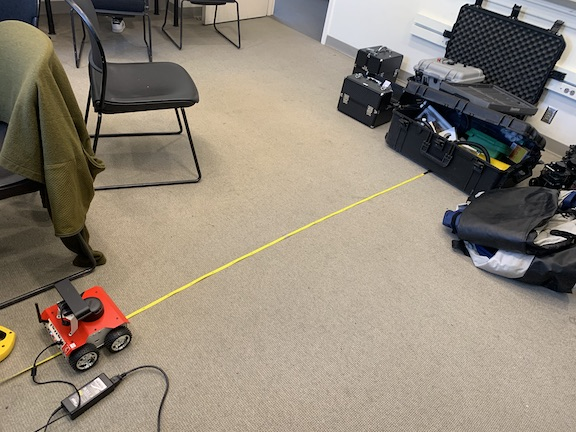

# Programming Assignment 1
Julien Blanchet - CS169 - 1/21/2020

**KEY LINKS**
* ROSBag & Results csv file https://1drv.ms/u/s!AiFiPYRO3Kyph49sCXQj4euRLGRaRA?e=ATnOvU
* Github repository with code https://github.com/j55blanchet/cs169_julienb_pa1

## Description

I broke this assignment up into different launch files for each task, including two launch files for task #2 (even though no additional code was necessary to achieve the data collection, the launch files make it easier to run and repeat).

### Task 1
This task was very simple, and I chose to make the code for it simple as well. The node simply waits for 5 seconds (to allow for the system to initialize) and the proceeds forward at 0.2 m/s (chosen to make the 1m distance of task #2 last 5s). The target distance is set via a parameter. There are several enhancements I could have made in order to achieve a more robust "distance-goer":
1. I could have incorporated feedback from the odometry system (via a subscriber to the `/pose` topic) and used that to determine when to stop rather than a simple timer.
2. The speed to travel could have been provided as a parameter, rather then being a constant. (it could even be read from a topic, if a dynamic speed was called for).
3. The robot could slow down as it approaches its target distance, to avoid overshooting and increase precision of distance traveled.

### Task 2
I achieved this task with a 2 step process. The first launch file, `datacollection.launch`, simply starts up the rosbot's sensing and movement systems (including the node wrote for task #1). The second launch file, `rosbag_record.launch`, launches the rosbag node, using a topic list specified as an agrument in the launch file. I chose these topics by starting the sensing systems, running `rostopic list`, and choosing all topics besides the uncompressed images. 

For my experimental setup, I placed the rosbot 2m away from a box (high enough to be detected from the LIDAR scanner), as measured with a measuring tape - see photo below. I used the measuring tape to record the reading after the robot had finished its attempt at a 1m travel.

### Task 3

Task 3 was very simple, to the point of triviality. My node simply reads a pose from the `/pose` topic and immediatedly republishes it. As `PoseStamped` messages are directly visualizable in rviz, I elected to republish with the same message type rather then sending a `visualization_msgs/Marker` message.

For the launch file, I elected to also run the `teleop_twist_keyboard` node in order to be able to control the robot and observe corresponding changes in pose through rviz.

## Evaluation

### Task 1

My program successfully started the ROSBot systems and drove it forward. I did notice a lag between when my program sends the first `/cmd_vel` msg and when the ROSbot actually starts moving, which I believe is partially responsible for the inaccuracy observed on Task 2 (next section). As future work, I'd attempt to mitigate this by sending empty (zero velocity) messages during the initial waiting period to "wake up" the motor subsystem.

### Task 2

I was able to successfully record a bag of the sensor readings of the ROSbot. Like other members of the class, the terminal reported errors related to image compression. I had designed the launch files for task 2 with the intention of being able to stop the rosbag node gracefully without waiting for the rest of the system to shutdown, but I noticed that hitting ctl-C on the rosbag launch file terminal resulted in the output bag file being still "active" and requiring a reindexing before being used. This wasn't a big issue, but it could perhaps be mitigated by using a programmatic ROSLaunch API to stop the node from code (as I did in the previous class with `teleop_twist_keyboard` in our final project).

The csv data is in the table below and is also available (along with the ROSBag file) at https://1drv.ms/u/s!AiFiPYRO3Kyph49sCXQj4euRLGRaRA?e=ATnOvU

| Start Distance | End (actual) | End (expected) |
| - | - | - |
|2 m |1.15 m|1 m

### Task 3

My code for task 3 works and is viewable in rviz. You can observed the changes in pose in rviz when controlling the robot with the keyboard.

## Allocation of Effort
As this was an individual programming assignment, all work was done by myself. I did discuss with Mingi how to incorporate rosbag into a launch file.
